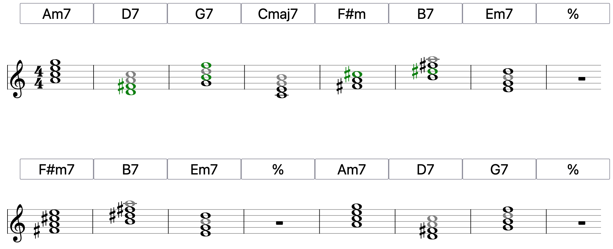

When I'm soloing I want to know what the "new" notes are as 
the chords change: notes that the listener hasn't heard lately
or at all (in this song). That's the idea. I may explore other
ideas once I have the basic mechanics working.

In this one, we see "new" notes in green, and repeated 
notes in gray:

I see this as a tool for analysis, not any sort of real-time usage. 
I was inspired by [Bob Keller's "How to Key-Map a Tune"](https://www.cs.hmc.edu/courses/common/mus84/KeyMaps.pdf), which brings Excel spreadsheets into the jazz (why not?).

Right now, you enter chords yourself. I went this route 
hunting around for existing libraries and not finding anything 
that would work well.

## Credits

- uses a library called [vexflow](https://github.com/0xfe/vexflow/) for rendering the notes and staves.
- uses a library called `chord-symbol` to translate chord symbols
  to notes.
